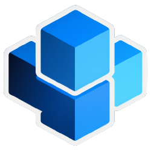

> **Note**  
> This repository only stores the frontend source codes for Σ Platform & λ Engine.

   
   <h1>λ: Serverless Engine</h1>
   <h2>Managed Serverless Service by KevinZonda</h2>

---

Yer another go-based FaaS platform.

λ Engine is the Serverless Engine of [Σ Platform by KevinZonda](https://lambda.kevinzonda.com/panel).